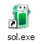

# Solitaire

This application simulate early 2000s version of computer game of [Klondike](https://en.wikipedia.org/wiki/Klondike_(solitaire)) solitaire.

## Press icon to play

## Instructions

Original game was made for screens with aspect ratio 4:3 and resolution at least 640x480. It was controlled only with mouse. On the ground of this facts, this app does not support touch devices.

Game has its own help, where you can learn how to play. To launch help press <kbd> F1 </kbd> or on Help menu, click Contents.

## Built With

* [React](https://reactjs.org/) – A JavaScript library for building user interfaces.
* [Redux](https://redux.js.org/) – A predictable state container for JavaScript apps.
* [SASS](https://sass-lang.com/) – CSS extension language.
* [Deck of Cards API](https://deckofcardsapi.com//) – An API for shuffling deck.
